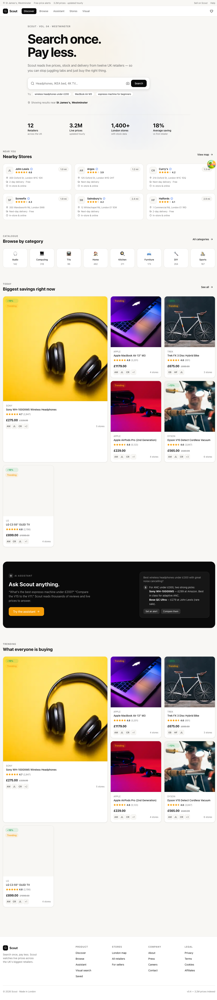
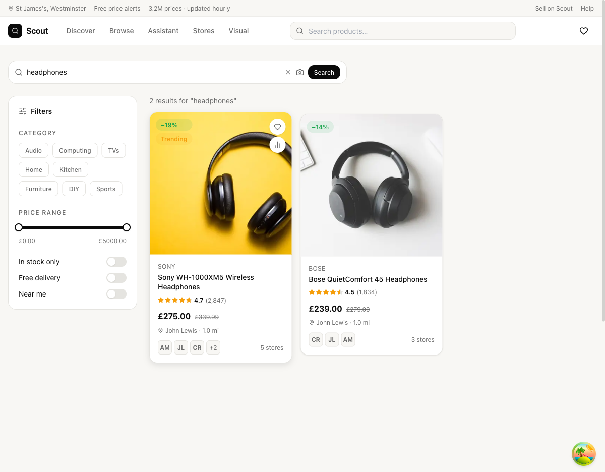
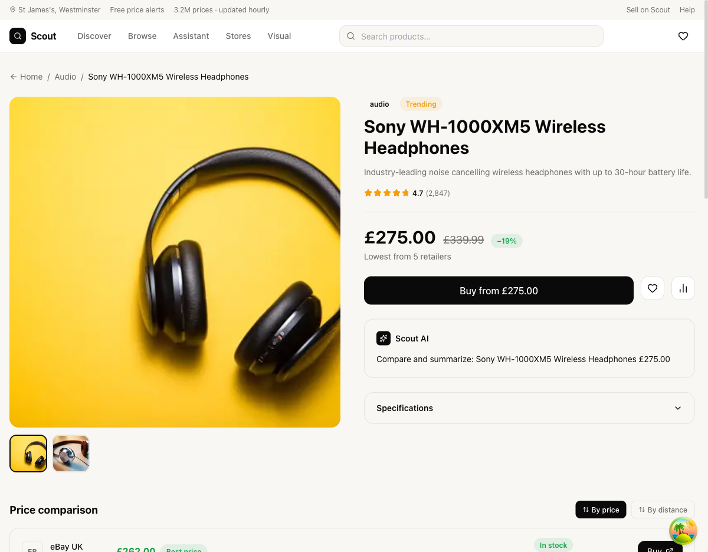
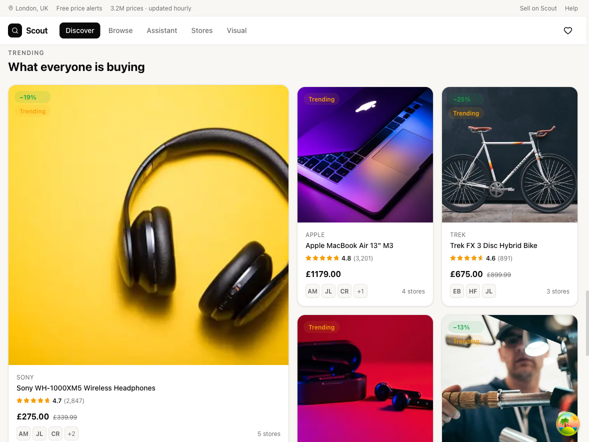
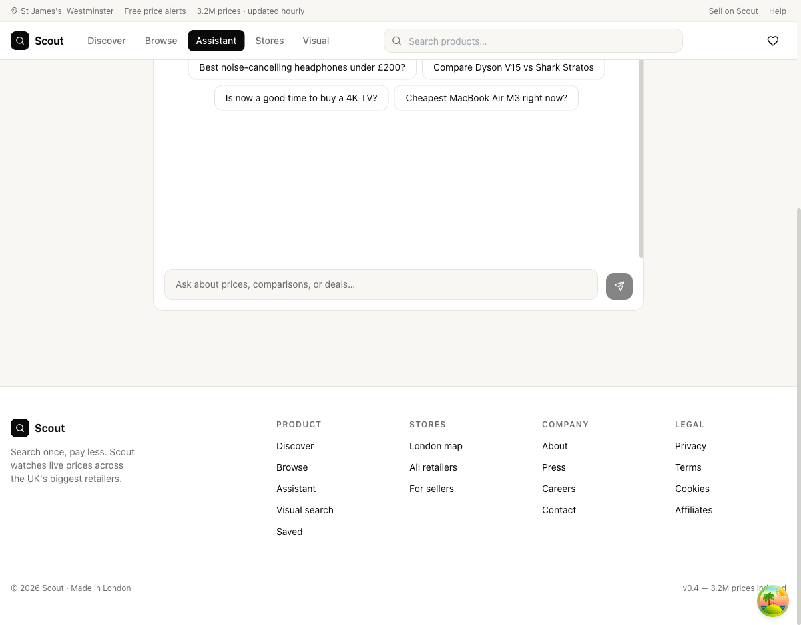

# Scout — Search once. Pay less.

Live price comparison across 50+ retailers. Scout tracks stock, delivery, and price drops so you never overpay — whether you're shopping online or in-store.

**[→ Live at scout-six-taupe.vercel.app](https://scout-six-taupe.vercel.app)**



---

## Features

- **Live price comparison** — real-time prices from 50+ online and physical retailers
- **Smart search** — keyword search with category, price range, stock, delivery, and proximity filters
- **AI Assistant** — ask anything: "cheapest noise-cancelling headphones under £200?" or "compare Dyson V15 vs Shark Stratos"
- **Visual search** — upload a photo of any product and Scout finds the best prices instantly
- **Store map** — browse physical stores near you, filter by category, see opening hours
- **Price alerts** — set a target price and get notified when it drops
- **Save items** — wishlist synced to your Google account across devices
- **Price history** — see discount percentages against RRP at a glance
- Fully responsive — mobile, tablet, and desktop

## Screenshots

### Homepage — Hero Search


### Search Results — Filters & Price Comparison


### Product Page — Price Breakdown & Store Comparison


### Trending — What Everyone's Buying


### AI Assistant — Ask Scout Anything


---

## Tech Stack

| Tool | Purpose |
|------|---------|
| [Next.js 14](https://nextjs.org) | App Router, SSR, OG image generation |
| [React 18](https://react.dev) | UI framework |
| [Tailwind CSS](https://tailwindcss.com) | Styling |
| [TanStack Query](https://tanstack.com/query) | Data fetching & caching |
| [Zustand](https://zustand-demo.pmnd.rs) | Client state (wishlist, location) |
| [Framer Motion](https://www.framer.com/motion/) | Animations |
| [NextAuth.js](https://next-auth.js.org) | Google OAuth authentication |
| [SerpAPI](https://serpapi.com) | Live product & store data |
| [Anthropic Claude](https://anthropic.com) | AI Assistant & product summaries |
| [Vercel](https://vercel.com) | Deployment |

---

## Getting Started

```bash
# Clone the repo
git clone https://github.com/kamensgh/scout.git
cd scout

# Install dependencies
npm install

# Start dev server
npm run dev
```

Open [http://localhost:3000](http://localhost:3000) in your browser.

### Environment Variables

Create a `.env.local` file in the project root:

```env
# SerpAPI — live product and store data
SERPAPI_KEY=your_serpapi_key

# Anthropic — AI assistant and product summaries
ANTHROPIC_API_KEY=your_anthropic_key

# Google OAuth — user accounts and saved items
GOOGLE_CLIENT_ID=your_google_client_id
GOOGLE_CLIENT_SECRET=your_google_client_secret

# NextAuth
NEXTAUTH_SECRET=your_nextauth_secret
NEXTAUTH_URL=http://localhost:3000
```

> **SerpAPI** — sign up at [serpapi.com](https://serpapi.com) (100 free searches/month)
>
> **Google OAuth** — create credentials at [console.cloud.google.com](https://console.cloud.google.com) → APIs & Services → Credentials

---

## Project Structure

```
src/
├── app/
│   ├── api/               # Route handlers (search, products, stores, AI, auth)
│   ├── chat/              # AI Assistant page
│   ├── image-search/      # Visual search page
│   ├── map/               # Store map page
│   ├── product/[id]/      # Product detail page
│   ├── saved/             # Wishlist & price alerts
│   ├── search/            # Search results page
│   └── trending/          # Trending products page
├── components/
│   ├── ai/                # AI assistant chat UI
│   ├── layout/            # Navigation, Footer, Providers
│   ├── location/          # Location picker & gate
│   ├── products/          # ProductCard, ProductGallery, PriceComparisonTable
│   ├── search/            # SearchBar, PriceLeaderboard, ImageUpload
│   └── ui/                # Badge, Button, Skeleton, StarRating
├── lib/
│   ├── auth.ts            # NextAuth config
│   ├── retailers.ts       # Retailer definitions and metadata
│   └── utils.ts           # Shared helpers
├── store/
│   ├── location-store.ts  # User location (Zustand)
│   └── wishlist-store.ts  # Saved products & price alerts (Zustand + localStorage)
└── types/
    └── index.ts           # Shared TypeScript types
```

---

## API Routes

| Route | Description |
|-------|-------------|
| `GET /api/search` | Search products via SerpAPI |
| `GET /api/products/[id]` | Product detail with store prices |
| `GET /api/stores` | Retailers near a location |
| `GET /api/stores/[id]/categories` | Store browse categories |
| `GET /api/trending` | Trending products |
| `POST /api/ai/chat` | AI Assistant (Claude) |
| `POST /api/ai/product-details` | AI product description & specs |
| `POST /api/image-search` | Visual search via image upload |
